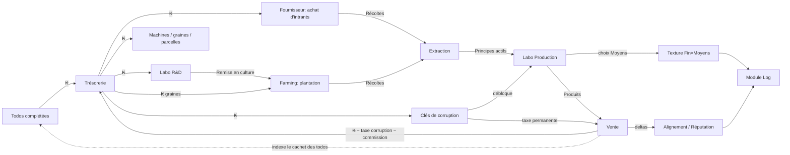

# 02 — Économie et équilibrage

Toutes les valeurs de ce document sont des **valeurs initiales de calibrage**, à répliquer dans un unique fichier de constantes `/src/game-logic/balance.ts`. Aucun nombre d'équilibrage ne doit apparaître ailleurs dans le code. Les formules, elles, sont normatives.

## 1. Ressources canoniques

| Code | Nom | Type | Source | Puits |
|---|---|---|---|---|
| `KESS` (₭) | Kessler | **monnaie unique** (DEC-14) | Complétion de todos, streaks d'habitudes, vente de produits, subventions | R&D, machines, intrants du Fournisseur, graines, parcelles, nettoyage d'atelier, clés de corruption, événements, dette d'ouverture, pénalités d'habitudes |
| `HARVEST_<plant>` | Récolte (par plante) | intrant | Farming | Extraction |
| `PA_<plant>` | Principe actif (par plante) : `PA_MED`, `PA_REC`, `PA_IND`, `PA_TOX` | intrant raffiné | Extraction (labo) | Recettes |
| `PRODUCT_<recipe>` | Produit fini (par recette) | sortie | Production labo | Vente, contrats d'événements |
| `REP_COOP` / `REP_ZONE` / `REP_BROKER` | Réputation par faction (−100..+100) | jauge | Actions, événements | Paiements d'événements |
| `ALIGNMENT` | Score d'alignement (−100..+100, **caché**) | jauge | Voir `06` §5 | — |
| `CORRUPTION_TAX` | Taux de taxe permanente (0..50 %) | état | Clés de corruption | Irréversible en V1 |
| `POLLUTION` | Pollution d'atelier (0..50 %) | état | Procédé dégradant | Cycle de nettoyage |
| `DEBT_ENV` | Dette environnementale (0..80 %, par parcelle) | état | Monoculture intensive | Agroécologie, jachère |

Invariant : **l'atelier ne s'amorce pas tout seul.** La mise de départ (35 ₭) ne couvre que le premier plan ; sans tâche cochée, il n'y a ni machine, ni intrant, ni vente. C'est la propriété que le simulateur vérifie sous la stratégie `idle` (`tests/balance.test.ts`).

## 2. Flux général



## 3. Boucles de jeu

- **Boucle courte (minutes)** : compléter une todo → ₭ → acheter un intrant ou lancer un cycle → repartir travailler.
- **Boucle moyenne (heures/jours)** : cycle plantation → récolte → extraction → production → vente ; résolution d'un événement de corruption ; progression d'un streak.
- **Boucle longue (semaines)** : arbre de tech complet, montée en Mk2, trajectoire d'alignement qui se dessine, remboursement de la dette d'ouverture, lettres d'arc narratif.

## 4. Le cachet des todos

Tout le module Todos est exprimé en **unités de barème**, converties en ₭ par une
seule fonction. C'est le seul endroit à régler pour déplacer le curseur entre
« mon travail réel paie » et « mon atelier paie ».

```
unité(état) = max(1, meilleur_prix_de_vente_net_accessible ÷ 11)
cachet(todo) = max(1, round(barème[difficulté] × unité(état)))
```

`meilleur_prix_de_vente_net_accessible` est le `prix_effectif` (§9) de la
meilleure recette que le joueur peut réellement lancer — technos, clé et niveau
de machine compris. Il est **net** : la taxe de corruption, la pollution et le
modificateur de bande y sont déjà appliqués. Conséquence voulue : s'endetter
auprès de la Zone rabote aussi la valeur d'une heure de votre temps.

On indexe sur le catalogue plutôt que sur la trésorerie pour que le cachet monte
par **paliers francs** (un nouveau produit débloqué) et non par à-coups suivant
le solde du moment.

| Difficulté | Libellé | Barème | Cachet au départ | Cachet avec Remède premium |
|---|---|---|---|---|
| 1 | Trivial | 3 | 3 ₭ | ~66 ₭ |
| 2 | Facile | 6 | 6 ₭ | ~133 ₭ |
| 3 | Normal | 12 | 12 ₭ | ~266 ₭ |
| 4 | Corvée | 24 | 24 ₭ | ~532 ₭ |

- Récurrente flexible : chaque occurrence validée rapporte le cachet de sa difficulté ; si les `N` occurrences de la période sont toutes validées, la dernière rapporte **+25 %** (arrondi supérieur).
- Une todo peut définir un `gain` custom (ressource + quantité) qui **s'ajoute** au cachet, et/ou une `perte` custom appliquée au dépassement d'échéance. Sans `perte` déclarée, rater une échéance ne coûte rien (pilier "l'échéance pardonne").

### Habitudes binaires (abstinence)

- Journée validée par défaut → à minuit : `rente passive = (1 + 0.1 × streak) × unité`, le facteur étant plafonné à **3 unités/jour**.
- Échec ("j'ai craqué") : streak remis à 0 **et** perte immédiate `min(streak, 30) × 1 unité` (aversion à la perte : l'écart coûte d'autant plus que le streak était long, plafonné).

### Habitudes compteur (cumulatif)

Seuils définis par l'utilisateur à la création : `s1` (fin de zone neutre) et `s2` (fin de zone légère), avec `0 ≤ s1 ≤ s2`.

À minuit, pour un compteur `n` :

```
n ≤ s1          → 0
s1 < n ≤ s2     → pénalité = (n − s1) × 1 unité
n > s2          → pénalité = ((s2 − s1) × 1 + ceil(2 × (n − s2)^1.5)) unités
```

Pénalité quotidienne plafonnée à **40 unités**. La pénalité se déduit de la trésorerie (plancher 0 — pas de solde négatif) ; l'historique quotidien `{date, n, pénalité}` est conservé intégralement pour les vues de tendance du Log.

## 5. Courbes de coût

Formule standard pour tout achat répétable (parcelles, upgrades, graines en volume) :

```
cost(n) = ceil(base × 1.12^n)      // n = nombre déjà possédé
```

Le ratio 1.12 est le point d'équilibre du design idle classique (fluide sans stagnation). La branche illégale ne modifie pas cette courbe : elle court-circuite des **paliers** contre une taxe permanente (accordéon, voir `06`).

## 6. Machines et production

Durée de cycle : `durée(Mk) = base × 0.85^(Mk−1)`. Le rendement (quantités d'intrants/sorties) est fixé par la recette, pas par la machine.

Tous les coûts sont en ₭ (DEC-14).

| Machine / recherche | Cycle base | R&D (₭) | Construction (₭) | Upgrade Mk2 (₭) | Notes |
|---|---|---|---|---|---|
| Extracteur | 60 s | 20 | 0 (matériel de l'oncle, DEC-10) | 1800 | Convertit 1 récolte → 1 PA du type de la plante |
| Remise en culture | — | 150 | — | — | Ouvre le farming : 2 parcelles + 3 graines médicinales (DEC-16) |
| Convoyeur | — | 300 | — | — | Enchaîne automatiquement les cycles tant que les intrants sont disponibles |
| Distillateur | 90 s | 700 | 400 | 2600 | Requis pour Remède standard+ |
| Synthétiseur | 120 s | 1400 | 900 | 3600 | Porte d'entrée de la branche illégale |
| Catalyse | — | 2600 | — | — | +10 % rendement de vente sur tous les produits du labo ; débloque les upgrades Mk2 |

Presse et Catalyseur (machines) : templates définis dans `08` mais hors périmètre V1 (V1.5).

Sans convoyeur, chaque cycle doit être relancé manuellement (clic). Avec convoyeur, la production tourne en continu — c'est le vrai basculement "idle" du jeu.

## 7. Recettes V1 (les 6 "signature", DEC-08)

| Recette | Intrants | Sortie/vente | Machine | Prérequis | Tag Fin |
|---|---|---|---|---|---|
| Tonique de base | 2 PA_MED | 16 ₭ | Extracteur | — | bénéfique |
| Remède standard | 3 PA_MED + 1 PA_IND | 60 ₭ | Distillateur | — | bénéfique |
| Remède premium | 5 PA_MED + 2 PA_IND | 180 ₭ | Distillateur Mk2 | Catalyse | bénéfique |
| Extrait brut | 2 PA_REC | 45 ₭ | Synthétiseur | Clé 1 | neutre |
| Composé actif | 3 PA_REC + 2 PA_TOX | 140 ₭ | Synthétiseur | Clé 2 | nocif |
| Produit raffiné | 6 PA_TOX + 2 PA_REC | 400 ₭ | Synthétiseur Mk2 | Clé 3 + Catalyse | nocif |

Depuis que les intrants s'achètent (§7b), les prix sont des **prix bruts sur une
matière payée** : la marge, et non le prix affiché, est la grandeur à surveiller.
Les recettes illégales sont volontairement **gourmandes en intrants** — elles
convertissent du temps de culture en argent plus vite, mais consomment davantage
de la ressource réellement rare, la matière.

## 7b. Le Fournisseur (DEC-16)

Avant la « Remise en culture », les récoltes ne se cultivent pas : elles
s'achètent au comptant. L'étal reste ensuite disponible pour combler un trou de
stock.

```
prix_unitaire(plante) = max(2, ceil(coût_graine ÷ rendement_de_base × 2.6))
quota_du_jour        = 12 + 3 × nombre_de_parcelles
```

| Plante | Cultivée (₭/unité) | Au comptant (₭/unité) |
|---|---|---|
| Médicinale | ~1,7 | 5 |
| Industrielle | 4 | 11 |
| Récréative | 4 | 11 |
| Toxique | 12,5 | 33 |

Trois règles portent tout l'intérêt du palier :

1. **Le prix est dérivé, jamais saisi** : acheter coûte toujours 2,6 fois ce que
   coûterait la même unité cultivée. Aucune dérive possible entre les deux voies.
2. **Le quota quotidien est le vrai frein.** Sans lui, acheter serait illimité et
   cultiver n'aurait aucun intérêt : la remise en culture ne serait qu'un
   changement d'écran. Chaque parcelle assouplit légèrement le quota — l'atelier
   qui produit sa matière inspire davantage confiance à la Zone.
3. **L'étal est fermé tant qu'aucune machine n'est montée**, et ne propose que
   les plantes qu'on saurait cultiver (mêmes conditions de déblocage). On ne peut
   pas dilapider sa mise de départ en matière inutilisable.

## 8. Choix des Moyens (à chaque lancement de production ou plantation)

| | Propre / Agroécologie | Dégradant / Intensif |
|---|---|---|
| **Labo** | Durée nominale, 0 pollution | Durée −25 %, +0.5 % pollution d'atelier par cycle |
| **Farming** | Coût graine ×1.2, durée +20 %, dette −1 %/récolte | Rendement +50 %, dette +2 %/récolte |

- Pollution d'atelier : les ventes du labo sont multipliées par `(1 − POLLUTION)`. Nettoyage : 120 ₭ → −5 % de pollution.
- Dette environnementale (par parcelle) : rendement de la parcelle × `(1 − DEBT_ENV)`. Jachère : parcelle en pause, −2 %/heure.

## 9. Ventes, prix effectifs

```
prix_effectif = prix_base
              × (1 + 0.10 si Catalyse)                    // labo uniquement
              × (1 − POLLUTION)                            // labo uniquement
              × (1 − CORRUPTION_TAX)                       // toutes ventes
              × modificateur_de_bande                      // voir ci-dessous
              × (1 − 0.15 si bande neutre)                 // commission du Courtier
```

Modificateurs de bande d'alignement :

| Bande | Ventes légales | Ventes illégales | Autres effets |
|---|---|---|---|
| Coopérative (score ≥ +30) | +25 % | prix nominal, probabilité d'événement ×1.4 | Subventions accessibles |
| Neutre / Courtier (−30 < score < +30) | nominal | nominal | Commission 15 % sur tout ; pertes de réputation ×1.5 lors des événements |
| Zone (score ≤ −30) | −10 % | +10 % | Subventions inaccessibles |

Subventions Coopérative : requiert `REP_COOP ≥ 20` et Remède premium débloqué → **100 ₭/semaine** + **−20 %** sur les coûts de R&D restants.

## 10. Corruption (résumé chiffré — détail dans `06`)

| Clé | Prix (₭) | Taxe ajoutée | Débloque |
|---|---|---|---|
| Clé 1 | 300 | +10 % | Extrait brut, graine toxique |
| Clé 2 | 1200 | +15 % | Composé actif |
| Clé 3 | 3600 | +20 % | Produit raffiné |

Taxe cumulée maximale V1 : 45 %. Depuis DEC-14 elle mord deux fois : sur les
ventes, et — via l'indexation du cachet sur le prix **net** (§4) — sur ce que
rapporte une tâche cochée. C'est ce qui fait de la corruption totale un piège
mesurable plutôt qu'une pénalité de façade. La taxe est permanente (irréversible en V1) et s'applique à **toutes** les ventes — c'est le prix payé en vitesse long terme.

Événements ponctuels : après achat de la Clé 1, chaque cycle de production illégale terminé tire un événement avec `p = 1/17` (moyenne ~15-20 cycles, cf. aversion à la perte §12), cooldown minimal de 3 cycles entre deux événements, jamais deux fois le même déclencheur consécutivement.

## 11. Cycle quotidien et offline

- **Minuit local** : reset des compteurs d'habitudes, validation des binaires, calcul des pénalités, rente passive des streaks, **recharge du quota du Fournisseur**, decay d'alignement (−0.5 vers 0), tick hebdo de subvention (lundi).
- **Rattrapage au lancement / réveil** : `elapsed = clamp(now − lastTickAt, 0, ∞)`. Chaque jour intermédiaire manqué est traité séquentiellement (les habitudes binaires des jours absents sont validées par défaut).
- **Plafond offline** : la production machines (avec convoyeur) rattrape au maximum **12 h** par absence (DEC-11). La croissance des plantes n'est pas plafonnée (durée fixe, timestamp de fin). Les événements de corruption ne se déclenchent jamais offline — ils se tirent uniquement sur des cycles complétés pendant que l'app tourne.

## 12. Principes de calibrage (rationale de recherche)

Repères théoriques qui justifient les choix ci-dessus — à préserver lors des ajustements :

- **Renforcement à ratio variable (Skinner)** : socle de la branche illégale ; l'amplitude des gains/pertes aléatoires est volontairement **plafonnée** (pas de jackpot infini) pour rester du côté ludique du mécanisme.
- **Aversion à la perte (Kahneman & Tversky)** : une perte pèse ~2× un gain équivalent → les retombées catastrophiques restent **rares mais mémorables** (1 événement / 15-20 cycles), et la perte de streak croît avec sa longueur mais est plafonnée à 30 unités de barème.
- **Courbes exponentielles idle (×1.10–1.15)** : ratio 1.12 retenu partout.
- **Flow (Csikszentmihalyi)** : le rythme des déblocages de l'arbre (voir `04` §2) est calibré pour qu'il y ait toujours exactement un objectif atteignable en < 2 jours de todos normales.
- **Prestige / reset doux** : hors V1, mais l'architecture de données doit permettre un multiplicateur permanent post-reset (V2) sans migration destructive.

## 13. Courbe de première session (sanity check)

Cible : un joueur qui complète ~6 todos normales/jour. Chiffres relevés au
simulateur (`npm run sim -- --days 21 --seed 42 --strategy legal`), pas estimés.

| Jour | Ce qui se passe | ₭ cumulés | Part venant des todos |
|---|---|---|---|
| 1 | R&D Extracteur (20 ₭) ; l'étal du Fournisseur s'ouvre ; premiers Toniques | 99 | 73 % |
| 3 | Remise en culture (150 ₭) : deux parcelles et trois graines | 347 | 73 % |
| 6 | Convoyeur (300 ₭) → vraie boucle idle | 1 161 | 45 % |
| 8 | Distillateur (700 + 400 ₭), Remèdes standard | 2 008 | 35 % |
| 12 | Dette d'ouverture soldée, 5ᵉ recherche | 5 134 | 41 % |
| 14-17 | Synthèse avancée, parcelles 3 à 5 | 12 354 | 37 % |
| 18-21 | Catalyse, Mk2, Remède premium | 21 492 | 36 % |

Deux propriétés tenues par `tests/balance.test.ts`, et non par l'œil :

- **la stratégie `idle`** (aucune todo cochée) termine à **0 ₭ de production** et
  sans la moindre machine : le jeu ne se joue pas tout seul ;
- la part des todos reste entre **20 % et 80 %** du revenu sur toute la partie,
  et le cachet d'une journée type est toujours **plus élevé en fin qu'en début**
  de partie.

Tout écart significatif constaté en jouant se corrige dans `balance.ts` uniquement.
