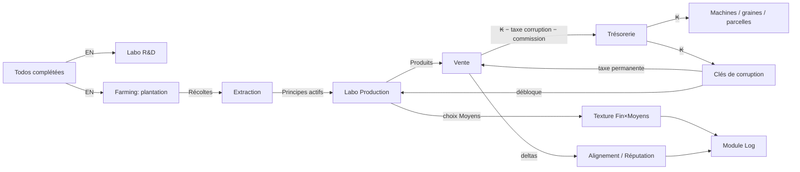

# 02 — Économie et équilibrage

Toutes les valeurs de ce document sont des **valeurs initiales de calibrage**, à répliquer dans un unique fichier de constantes `/src/game-logic/balance.ts`. Aucun nombre d'équilibrage ne doit apparaître ailleurs dans le code. Les formules, elles, sont normatives.

## 1. Ressources canoniques

| Code | Nom | Type | Source | Puits |
|---|---|---|---|---|
| `EN` | Énergie | flux primaire | Complétion de todos, streaks d'habitudes | R&D, plantation, nettoyage d'atelier, pénalités d'habitudes |
| `KESS` (₭) | Kess | monnaie | Vente de produits, subventions | Machines, graines, parcelles, clés de corruption, événements, dette d'ouverture |
| `HARVEST_<plant>` | Récolte (par plante) | intrant | Farming | Extraction |
| `PA_<plant>` | Principe actif (par plante) : `PA_MED`, `PA_REC`, `PA_IND`, `PA_TOX` | intrant raffiné | Extraction (labo) | Recettes |
| `PRODUCT_<recipe>` | Produit fini (par recette) | sortie | Production labo | Vente, contrats d'événements |
| `REP_COOP` / `REP_ZONE` / `REP_BROKER` | Réputation par faction (−100..+100) | jauge | Actions, événements | Paiements d'événements |
| `ALIGNMENT` | Score d'alignement (−100..+100, **caché**) | jauge | Voir `06` §5 | — |
| `CORRUPTION_TAX` | Taux de taxe permanente (0..50 %) | état | Clés de corruption | Irréversible en V1 |
| `POLLUTION` | Pollution d'atelier (0..50 %) | état | Procédé dégradant | Cycle de nettoyage |
| `DEBT_ENV` | Dette environnementale (0..80 %, par parcelle) | état | Monoculture intensive | Agroécologie, jachère |

Invariant : **l'Énergie n'est générée que par le module Todos.** Tout le reste transforme ou consomme.

## 2. Flux général



## 3. Boucles de jeu

- **Boucle courte (minutes)** : compléter une todo → EN → lancer/récolter quelque chose → repartir travailler.
- **Boucle moyenne (heures/jours)** : cycle plantation → récolte → extraction → production → vente ; résolution d'un événement de corruption ; progression d'un streak.
- **Boucle longue (semaines)** : arbre de tech complet, montée en Mk2, trajectoire d'alignement qui se dessine, remboursement de la dette d'ouverture, lettres d'arc narratif.

## 4. Génération primaire (Énergie)

### Todos

| Difficulté | Libellé | EN à la complétion |
|---|---|---|
| 1 | Trivial | 1 |
| 2 | Facile | 2 |
| 3 | Normal | 4 |
| 4 | Corvée | 8 |

- Récurrente flexible : chaque occurrence validée rapporte l'EN de sa difficulté ; si les `N` occurrences de la période sont toutes validées, la dernière rapporte **+25 %** (arrondi supérieur).
- Une todo peut définir un `gain` custom (ressource + quantité) qui **s'ajoute** à l'EN de difficulté, et/ou une `perte` custom appliquée au dépassement d'échéance. Sans `perte` déclarée, rater une échéance ne coûte rien (pilier "l'échéance pardonne").

### Habitudes binaires (abstinence)

- Journée validée par défaut → à minuit : `EN passif = 1 + 0.1 × streak`, plafonné à **3 EN/jour**.
- Échec ("j'ai craqué") : streak remis à 0 **et** perte immédiate `min(streak, 30) × 1 EN` (aversion à la perte : l'écart coûte d'autant plus que le streak était long, plafonné).

### Habitudes compteur (cumulatif)

Seuils définis par l'utilisateur à la création : `s1` (fin de zone neutre) et `s2` (fin de zone légère), avec `0 ≤ s1 ≤ s2`.

À minuit, pour un compteur `n` :

```
n ≤ s1          → 0
s1 < n ≤ s2     → pénalité = (n − s1) × 1 EN
n > s2          → pénalité = (s2 − s1) × 1 + ceil(2 × (n − s2)^1.5) EN
```

Pénalité quotidienne plafonnée à **40 EN**. La pénalité se déduit du solde d'EN (plancher 0 — pas de solde négatif) ; l'historique quotidien `{date, n, pénalité}` est conservé intégralement pour les vues de tendance du Log.

## 5. Courbes de coût

Formule standard pour tout achat répétable (parcelles, upgrades, graines en volume) :

```
cost(n) = ceil(base × 1.12^n)      // n = nombre déjà possédé
```

Le ratio 1.12 est le point d'équilibre du design idle classique (fluide sans stagnation). La branche illégale ne modifie pas cette courbe : elle court-circuite des **paliers** contre une taxe permanente (accordéon, voir `06`).

## 6. Machines et production

Durée de cycle : `durée(Mk) = base × 0.85^(Mk−1)`. Le rendement (quantités d'intrants/sorties) est fixé par la recette, pas par la machine.

| Machine | Cycle base | R&D (EN) | Construction (₭) | Upgrade Mk2 (₭) | Notes |
|---|---|---|---|---|---|
| Extracteur | 60 s | 10 | 0 (matériel de l'oncle, DEC-10) | 200 | Convertit 1 récolte → 1 PA du type de la plante |
| Distillateur | 90 s | 40 | 60 | 300 | Requis pour Remède standard+ |
| Synthétiseur | 120 s | 80 | 150 | 400 | Porte d'entrée de la branche illégale |
| Convoyeur (recherche) | — | 60 | — | — | Enchaîne automatiquement les cycles tant que les intrants sont disponibles |
| Catalyse (recherche) | — | 120 | — | — | +10 % rendement de vente sur tous les produits du labo ; débloque les upgrades Mk2 |

Presse et Catalyseur (machines) : templates définis dans `08` mais hors périmètre V1 (V1.5).

Sans convoyeur, chaque cycle doit être relancé manuellement (clic). Avec convoyeur, la production tourne en continu — c'est le vrai basculement "idle" du jeu.

## 7. Recettes V1 (les 6 "signature", DEC-08)

| Recette | Intrants | Sortie/vente | Machine | Prérequis | Tag Fin |
|---|---|---|---|---|---|
| Tonique de base | 2 PA_MED | 10 ₭ | Extracteur | — | bénéfique |
| Remède standard | 3 PA_MED + 1 PA_IND | 30 ₭ | Distillateur | — | bénéfique |
| Remède premium | 5 PA_MED + 2 PA_IND | 90 ₭ | Distillateur Mk2 | Catalyse | bénéfique |
| Extrait brut | 2 PA_REC | 25 ₭ | Synthétiseur | Clé 1 | neutre |
| Composé actif | 2 PA_REC + 1 PA_TOX | 70 ₭ | Synthétiseur | Clé 2 | nocif |
| Produit raffiné | 3 PA_TOX + 1 PA_REC | 200 ₭ | Synthétiseur Mk2 | Clé 3 + Catalyse | nocif |

## 8. Choix des Moyens (à chaque lancement de production ou plantation)

| | Propre / Agroécologie | Dégradant / Intensif |
|---|---|---|
| **Labo** | Durée nominale, 0 pollution | Durée −25 %, +0.5 % pollution d'atelier par cycle |
| **Farming** | Coût graine ×1.5, durée +20 %, dette −1 %/récolte | Rendement +50 %, dette +2 %/récolte |

- Pollution d'atelier : les ventes du labo sont multipliées par `(1 − POLLUTION)`. Nettoyage : 5 EN → −5 % de pollution.
- Dette environnementale (par parcelle) : rendement de la parcelle × `(1 − DEBT_ENV)`. Jachère : parcelle en pause, −2 %/heure.

## 9. Ventes, prix effectifs

```
prix_effectif = prix_base
              × (1 + 0.10 si Catalyse)                    // labo uniquement
              × (1 − POLLUTION)                            // labo uniquement
              × (1 − CORRUPTION_TAX)                       // toutes ventes
              × modificateur_de_bande                      // voir ci-dessous
              × (1 − 0.15 si bande neutre)                 // commission du Courtier
```

Modificateurs de bande d'alignement :

| Bande | Ventes légales | Ventes illégales | Autres effets |
|---|---|---|---|
| Coopérative (score ≥ +30) | +10 % | prix nominal, probabilité d'événement ×1.4 | Subventions accessibles |
| Neutre / Courtier (−30 < score < +30) | nominal | nominal | Commission 15 % sur tout ; pertes de réputation ×1.5 lors des événements |
| Zone (score ≤ −30) | −10 % | +10 % | Subventions inaccessibles |

Subventions Coopérative : requiert `REP_COOP ≥ 20` et Remède premium débloqué → **100 ₭/semaine** + **−20 %** sur les coûts de R&D restants.

## 10. Corruption (résumé chiffré — détail dans `06`)

| Clé | Prix (₭) | Taxe ajoutée | Débloque |
|---|---|---|---|
| Clé 1 | 100 | +3 % | Extrait brut, graine toxique |
| Clé 2 | 400 | +4 % | Composé actif |
| Clé 3 | 1600 | +5 % | Produit raffiné |

Taxe cumulée maximale V1 : 12 %. La taxe est permanente (irréversible en V1) et s'applique à **toutes** les ventes — c'est le prix payé en vitesse long terme.

Événements ponctuels : après achat de la Clé 1, chaque cycle de production illégale terminé tire un événement avec `p = 1/17` (moyenne ~15-20 cycles, cf. aversion à la perte §12), cooldown minimal de 3 cycles entre deux événements, jamais deux fois le même déclencheur consécutivement.

## 11. Cycle quotidien et offline

- **Minuit local** : reset des compteurs d'habitudes, validation des binaires, calcul des pénalités, EN passif des streaks, decay d'alignement (−0.5 vers 0), tick hebdo de subvention (lundi).
- **Rattrapage au lancement / réveil** : `elapsed = clamp(now − lastTickAt, 0, ∞)`. Chaque jour intermédiaire manqué est traité séquentiellement (les habitudes binaires des jours absents sont validées par défaut).
- **Plafond offline** : la production machines (avec convoyeur) rattrape au maximum **12 h** par absence (DEC-11). La croissance des plantes n'est pas plafonnée (durée fixe, timestamp de fin). Les événements de corruption ne se déclenchent jamais offline — ils se tirent uniquement sur des cycles complétés pendant que l'app tourne.

## 12. Principes de calibrage (rationale de recherche)

Repères théoriques qui justifient les choix ci-dessus — à préserver lors des ajustements :

- **Renforcement à ratio variable (Skinner)** : socle de la branche illégale ; l'amplitude des gains/pertes aléatoires est volontairement **plafonnée** (pas de jackpot infini) pour rester du côté ludique du mécanisme.
- **Aversion à la perte (Kahneman & Tversky)** : une perte pèse ~2× un gain équivalent → les retombées catastrophiques restent **rares mais mémorables** (1 événement / 15-20 cycles), et la perte de streak croît avec sa longueur mais est plafonnée à 30 EN.
- **Courbes exponentielles idle (×1.10–1.15)** : ratio 1.12 retenu partout.
- **Flow (Csikszentmihalyi)** : le rythme des déblocages de l'arbre (voir `04` §2) est calibré pour qu'il y ait toujours exactement un objectif atteignable en < 2 jours de todos normales.
- **Prestige / reset doux** : hors V1, mais l'architecture de données doit permettre un multiplicateur permanent post-reset (V2) sans migration destructive.

## 13. Courbe de première session (sanity check)

Cible : un joueur qui complète ~6 todos normales/jour (≈ 24 EN/jour).

1. Jour 1 : R&D Extracteur (10 EN) + plantation des 3 graines médicinales offertes → premières récoltes en ~20 min → extraction → 2-3 Toniques (~25 ₭).
2. Jours 2-3 : R&D Distillateur (40 EN), achat 60 ₭, Remèdes standard → ~100 ₭/jour.
3. Jours 4-7 : Convoyeur (60 EN) → vraie boucle idle ; choix : rembourser la dette de 500 ₭ à la Zone (voie légale) ou acheter la Clé 1 (voie rapide).
4. Semaine 2+ : Synthèse avancée, Catalyse, Mk2, trajectoire d'alignement installée.

Tout écart significatif constaté en jouant se corrige dans `balance.ts` uniquement.
