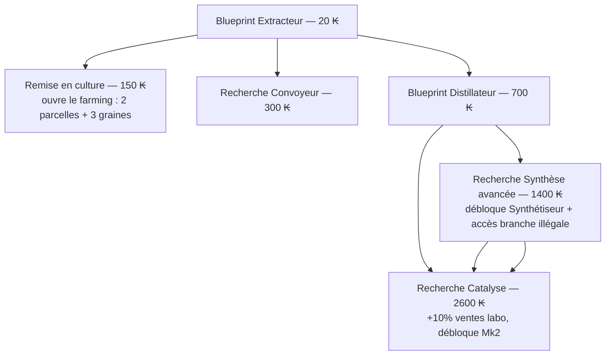

# 04 — Module Labo (Développement & Production)

Le labo est le cœur de transformation : il convertit des intrants — achetés au Fournisseur, puis cultivés — en produits vendables. Deux sous-modules distincts dans l'UI, un seul domaine logique.

## 1. Labo — Développement (R&D)

La R&D se paie en **kessler**, comme tout le reste (DEC-14) : c'est le lien direct « je fais mes todos → mon labo progresse », puisque les premières recherches ne sont finançables que par des tâches cochées. Une recherche est instantanée à l'achat (pas de temps d'attente en V1) ; la friction vient du coût, pas du délai.

### Arbre de tech V1

| Nœud | Coût (₭) | Effet |
|---|---|---|
| Blueprint Extracteur | 10 | Débloque Extracteur Mk1 (construction offerte — matériel de l'oncle, DEC-10) |
| Blueprint Distillateur | 40 | Débloque Distillateur Mk1 (construction 60 ₭) |
| Recherche Convoyeur | 60 | Les machines enchaînent leurs cycles automatiquement tant que les intrants sont disponibles — bascule le jeu en vrai idle |
| Recherche Synthèse avancée | 80 | Débloque Synthétiseur Mk1 (construction 150 ₭) ; rend visibles les clés de corruption et la branche illégale |
| Recherche Catalyse | 120 | +10 % sur toutes les ventes du labo ; débloque les upgrades Mk2 de toutes les machines |

Avec subvention Coopérative active : coûts de R&D restants −20 % (`02` §9).

### Extension V1.5 (définie, non implémentée en V1)

Presse (blueprint 3200 ₭) et Catalyseur passif (4000 ₭) — templates déjà présents dans `08-generation-procedurale.md` pour que l'ajout soit un pur ajout de data.

## 2. Machines

- Une machine = instance d'un **template** (`08` §3) avec `{level (Mk), status, position}`.
- Durée de cycle : `base × 0.85^(Mk−1)` ; les valeurs base et coûts sont dans `02` §6.
- Statuts : `idle` (prête), `running` (cycle en cours, timestamp de fin), `blocked` (intrants manquants — avec convoyeur, repasse à `running` dès que les intrants arrivent).
- Une machine exécute **une recette assignée** à la fois ; changer de recette est gratuit et instantané mais annule le cycle en cours (intrants rendus).
- V1 : une seule instance par type de machine (multi-instances = V2).

## 3. Labo — Production

### Lancement d'une production

1. Choisir la recette (parmi celles dont machine + prérequis sont satisfaits).
2. Choisir les **Moyens** : `propre` (durée nominale) ou `dégradant` (durée −25 %, +0.5 % pollution/cycle) — voir `02` §8. Ce choix est mémorisé par machine (pas re-demandé à chaque cycle) mais modifiable à tout moment.
3. Les intrants sont réservés au lancement du cycle ; la sortie est créditée à la fin du cycle.

### Vente

- V1 : vente **automatique** des produits finis au prix effectif (`02` §9) — pas de gestion de stock de produits ni de marché. Le flux visible pour le joueur : cycle terminé → `+X ₭` flottant, ligne dans le fil d'activité.
- Exception : pendant un **contrat d'événement** (résolution "service", `06` §4), les produits du type demandé sont retenus pour le contrat au lieu d'être vendus, jusqu'à atteindre la quantité due.

### Pollution d'atelier

- Jauge globale du labo (0–50 %). Ventes labo × `(1 − POLLUTION)`.
- Cycle de nettoyage : bouton dédié, coûte 120 ₭, −5 % pollution, instantané.
- La pollution est un état **visible** (jauge dans le panneau labo) — contrairement à l'alignement, il n'y a rien de caché ici.

## 4. Interaction avec la branche illégale

- Le Synthétiseur est la seule machine capable d'exécuter les recettes illégales.
- Chaque palier de recette illégale exige la clé de corruption correspondante (`02` §10, détail `06`).
- Chaque **cycle illégal complété** (app ouverte) incrémente le compteur de tirage d'événements (`06` §4).
- Un événement non résolu bloque le lancement de nouveaux cycles illégaux (DEC-09) ; les cycles légaux continuent.

## 5. Texture Fin × Moyens

Chaque production terminée calcule sa texture (`06` §6) à partir du tag Fin de la recette et du choix de Moyens. La texture n'a **aucun effet économique** : elle sélectionne des variantes de lettres dans le Log et colore les réactions des PNJ.

## 6. UI du panneau Labo (détail dans `11-ui-ux.md`)

- Deux onglets dans le dock : **R&D** (arbre compact, nœuds verrouillés/disponibles/acquis) et **Production** (une carte par machine : icône SVG animée si `running`, jauge de cycle, recette assignée, toggle Moyens, jauge pollution globale).
- Badges du dock replié : nombre de cycles terminés non vus, pastille si machine `blocked`.
- Skins : le visuel SVG de chaque machine évolue avec le Mk (variation de couleur/détail, pas de redessin — `12` §6).

## 7. Scénarios de test (obligatoires)

1. Cycle extracteur complet : 1 HARVEST_MED consommée au lancement, 1 PA_MED créditée à `endTime`, vente non déclenchée (PA n'est pas un produit).
2. Tonique : 2 PA_MED → cycle → +10 ₭ modulé par taxe/pollution/bande, vérifié sur 3 combinaisons de modificateurs.
3. Convoyeur : intrants pour 5 cycles → 5 cycles s'enchaînent sans action ; à sec → `blocked`, reprise automatique à l'arrivée d'intrants.
4. Offline 20 h avec convoyeur : production créditée = 12 h max (DEC-11), aucune vente d'événement tirée offline.
5. Moyens dégradants sur 10 cycles : pollution = 5 %, prix effectif réduit d'autant, retour à la normale après 1 nettoyage.
6. Upgrade Mk2 : durée de cycle réduite de 15 %, cycle en cours non affecté (le nouveau Mk s'applique au cycle suivant).
7. Changement de recette en cours de cycle : intrants rendus, aucun produit crédité.
