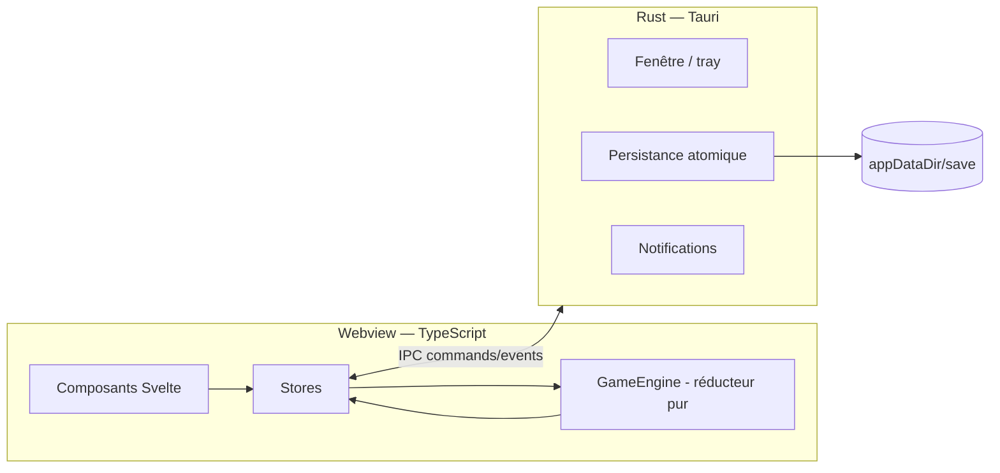

# 09 — Architecture technique

## 1. Stack (DEC-03)

| Couche | Choix | Rôle |
|---|---|---|
| Shell desktop | **Tauri 2.x** (Rust stable) | Fenêtre (transparence, always-on-top, tray), persistance atomique, notifications, single-instance |
| Frontend | **Svelte 5 + TypeScript strict + Vite** | UI, stores, rendu SVG |
| Logique de jeu | **TypeScript pur** dans `/src/game-logic` | Économie, moteurs, générateurs — zéro import Svelte/Tauri |
| Tests | **Vitest** (logique), `cargo test` (persistance Rust) | Voir `13` |

Pourquoi Tauri plutôt qu'Electron : binaire de quelques Mo (vs ~100+), mémoire au repos réduite — condition de survie pour un widget permanent. Pourquoi pas Godot : pas conçu pour vivre en overlay discret du bureau.

## 2. Découpage des responsabilités



**Toute la logique de jeu vit côté TS.** Rust ne connaît ni les todos ni l'économie : il stocke des bytes, gère la fenêtre et notifie. Cette frontière est non négociable — elle permet de tester 100 % du gameplay en Vitest sans lancer Tauri.

## 3. Le moteur — réducteur pur (DEC-07)

```ts
// /src/game-logic/engine.ts
applyAction(state: GameState, action: Action, now: Timestamp, rng: RngStreams)
  : { state: GameState; effects: Effect[] }

advanceTime(state: GameState, from: Timestamp, to: Timestamp, rng: RngStreams)
  : { state: GameState; effects: Effect[] }
```

- `Action` = union discriminée de toutes les intentions utilisateur (`CompleteTodo`, `PlantSeed`, `StartResearch`, `ResolveEvent`, …). L'UI ne mute **jamais** l'état directement.
- `advanceTime` traite séquentiellement : fins de cycles machines, fins de croissance, minuits traversés (resets, pénalités, decay, file de lettres), plafond offline. Il est appelé avec le même code au tick (1 s), au retour de veille et au lancement — **un seul chemin de code pour le temps**.
- `Effect` = faits notables produits par le calcul (`LetterUnlocked`, `EventTriggered`, `SaleCompleted`, `PanelBadge`, …). Les stores les consomment pour l'UI (toasts, badges) et le Registre du Log. Les effets sont des données, jamais des callbacks.
- **Règle d'or : aucun incrément par tick fixe.** Tout est fonction de `(state, from, to)` — résiste au throttling des timers, au masquage de fenêtre et aux absences.

### Boucle d'exécution

- `setInterval` 1 s → `advanceTime(state, lastTickAt, now)`. L'intervalle peut être throttlé par l'OS sans conséquence (le rattrapage est exact).
- `visibilitychange` / réveil machine → même appel immédiat.
- Lancement de l'app → `advanceTime(saved.lastTickAt, now)` = calcul offline (plafonds : `02` §11).

## 4. Gestion du temps

- Horloge locale, minuit local, semaine commençant lundi (`03` §3).
- `elapsed = max(0, to − from)` : un recul d'horloge ne produit jamais de temps négatif. Recul détecté > 1 h → warning dans le log technique, `lastTickAt = now`, aucune production rétroactive.
- Les timestamps sont des **millisecondes epoch UTC** stockées en nombre ; toute conversion calendaire (minuit, semaine) se fait à l'affichage et dans le moteur via des helpers `time.ts` centralisés (seul endroit autorisé à manipuler `Date`).

## 5. Persistance (DEC-02)

- Un fichier `appDataDir/save/state.json` = sérialisation directe de `GameState` (+ `meta.version`).
- **Écriture atomique côté Rust** : write temp → fsync → rename. Backups rotatifs : `state.backup.{1,2,3}.json` (rotation à chaque session, pas à chaque save).
- Déclencheurs d'autosave : debounce 2 s après toute action, intervalle 30 s pendant un `advanceTime` actif, `blur` de fenêtre, fermeture/masquage.
- Chargement : parse → validation de version → **migrations** séquentielles (`/src/data/migrations.ts`, tableau de fonctions `vN → vN+1`) → validation d'invariants (`10` §5). Échec de parse → tentative sur les backups, du plus récent au plus ancien ; tout échec = écran d'erreur avec export du fichier corrompu (jamais d'écrasement silencieux).
- Export/import manuel : boutons dans Réglages (fichier JSON, même format).

## 6. Surface IPC (exhaustive V1)

| Commande Rust | Signature | Rôle |
|---|---|---|
| `load_save` | `() → Option<String>` | Lit `state.json` (ou `None` si premier lancement) |
| `write_save` | `(json: String) → Result<()>` | Écriture atomique |
| `read_backup` | `(n: u8) → Option<String>` | Récupération |
| `set_always_on_top` | `(flag: bool)` | Toggle réglage |
| `set_window_opacity` | `(alpha: f64)` | Réglage d'opacité (si supporté par l'OS, sinon no-op) |
| `notify` | `(title, body)` | Notification système (échéances du jour à l'ouverture, V1) |
| `export_save_dialog` / `import_save_dialog` | | Dialogues fichiers natifs |

Événements Rust → TS : `tray://toggle-visibility`, `tray://quiet-mode`, `tray://quit`, `window://shown`. Plugins Tauri : `single-instance` (obligatoire — deux instances corrompraient la save), `notification`, `dialog`. Allowlist/capabilities Tauri réduite strictement à ces surfaces.

## 7. Fenêtre et tray (DEC-01)

- **Une fenêtre V1** : colonne droite. `decorations: false`, `transparent: true`, `skipTaskbar: true`, `alwaysOnTop: true` (toggleable), redimensionnable en largeur (320–480 px), hauteur = écran par défaut. Position/taille sauvegardées dans `settings`.
- Fermer la fenêtre = **masquer** (l'app vit dans le tray). Quitter réellement : menu tray. Fenêtre masquée, l'app continue de tourner : le moteur avance (timers throttlés → rattrapage exact au réaffichage), les animations sont mises en pause (`12` §8).
- Tray : icône d'état (pastille si événement en attente ou lettre non lue), menu : Afficher/Masquer, Mode discret, Quitter.
- Multi-écrans : la position sauvegardée est validée au lancement (si l'écran a disparu, recentrage sur l'écran principal).

## 8. Performance (budgets)

| Budget | Cible |
|---|---|
| RAM au repos | < 150 Mo |
| CPU fenêtre masquée | ~0 % (aucune animation, tick 1 s trivial) |
| CPU fenêtre visible idle | < 1 % |
| Taille du binaire | < 15 Mo |
| Démarrage → interactif | < 2 s |

Moyens : pas de lib d'animation (CSS uniquement), SVG inline légers, `prefers-reduced-motion` respecté, aucune dépendance runtime lourde (la liste des dépendances npm doit rester justifiable ligne à ligne).

## 9. Arborescence de projet (normative)

```
/src-tauri/
  src/main.rs            → setup fenêtre/tray/plugins
  src/persist.rs         → écriture atomique + backups (+ tests)
  tauri.conf.json        → config fenêtre, capabilities minimales
/src/
  main.ts, App.svelte
  /components/           → UI pure (aucune logique de jeu)
    Panel.svelte         → panneau repliable réutilisable (11 §3)
    todo/ lab/ farm/ log/ settings/
  /stores/               → état Svelte, pont moteur ↔ UI, autosave
  /game-logic/           → PUR (zéro import svelte/tauri)
    engine.ts  actions.ts  effects.ts  balance.ts  time.ts  rng.ts
    todos/ (recurrence.ts, habits.ts, parser.ts, parser-rules.fr.ts)
    lab.ts  farming.ts  corruption.ts  alignment.ts  texture.ts
    procgen/ (machines.ts, events.ts, letters.ts, naming.ts)
    data/ (recipes.data.ts, plants.data.ts, tech-tree.data.ts,
           event-pools.fr.ts, letter-templates.fr.ts)
  /data/                 → schema.ts (GameState), migrations.ts, save.ts
  /i18n/fr.ts            → tous les textes UI (DEC-04)
  /assets/svg/           → design tokens + bibliothèque SVG (12)
  /assets/fonts/         → polices bundlées localement (12 §4)
/tests/                  → miroirs de game-logic (Vitest)
/docs/                   → cette documentation
```

Frontière lint : une règle interdit tout import depuis `/src/components` ou `svelte`/`@tauri-apps` dans `/src/game-logic`, et l'usage de `Math.random`/`new Date()` hors `time.ts`/`rng.ts`.

## 10. Conventions

- TypeScript `strict: true` ; unions discriminées pour `Action`/`Effect` ; pas de classe pour l'état (objets sérialisables uniquement).
- Identifiants anglais, textes UI français centralisés (DEC-04). Prettier + ESLint config minimale committée.
- Commits par étape fonctionnelle, messages descriptifs en français ou anglais (cohérent au sein du repo).
- Aucune requête réseau au runtime (fonts et assets bundlés) — le jeu doit fonctionner hors ligne en permanence.
